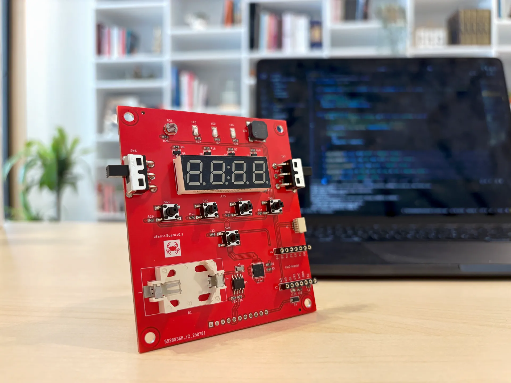
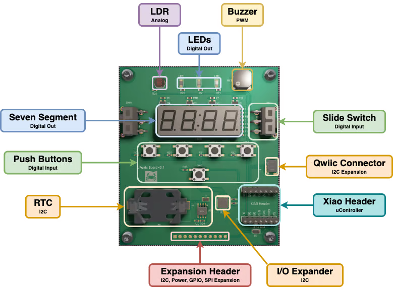
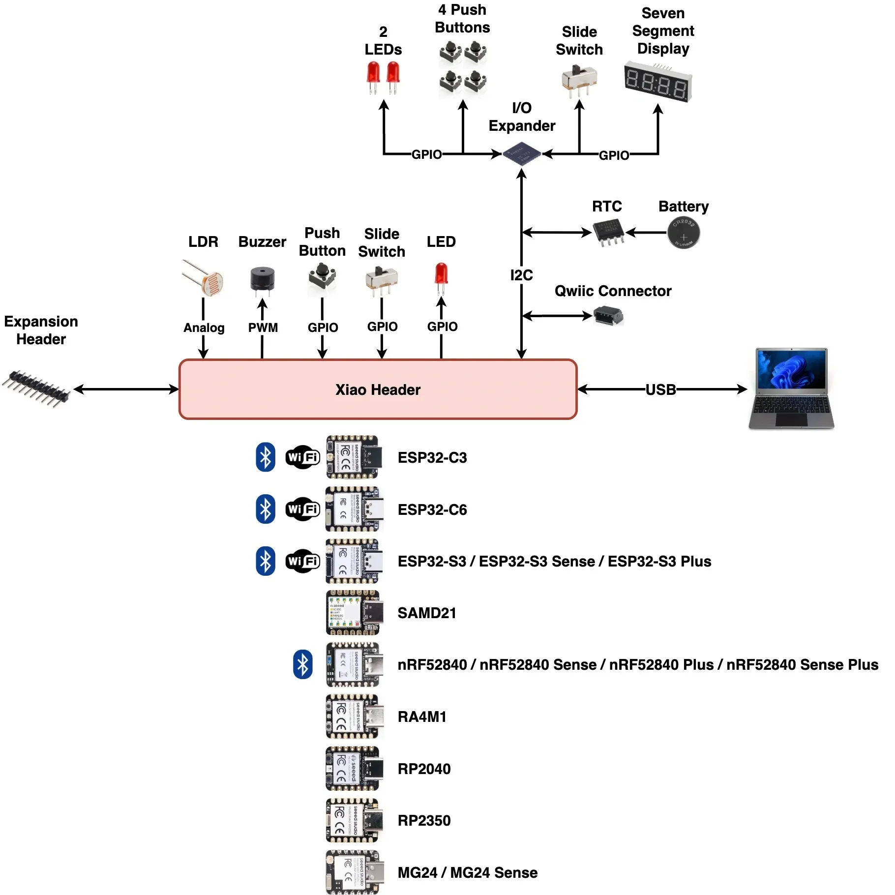

# 🦀 uFerris Embedded Rust Learner Board

  

 

**uFerris** is a versatile, all-in-one learner board designed to:

- Support multiple controllers on a single reference platform.
- Enable programming of standard peripherals (GPIO, Timers/Counters, Analog, PWM, Serial Comms).
- Allow learners to build a complete embedded product replica.
- Serve as a centralized reference for Rust embedded beginners.

## 🧱 Board Variants

### Megalops Baseboard
The baseboard is equipped with components that let you practice and apply your skills across all standard peripherals. The baseboard also features a SeeedStudio XIAO platform header, giving the flexibility to work with a wide range of controllers.

  

 

  

 

### Megalops Power Expansion Board

The Power Expansion Board lets the uFerris baseboard run independently of USB power. It features a 2×AAA battery holder with a current measurement circuit, making it easy to measure current consumption for your projects. It also includes an SD card holder—perfect for learning SPI and storing or logging data directly from your applications.

  

 

## 📁 Repository Structure
- [`boards/`](boards/) → Hardware designs (schematic, PCB, BOM)
- [`docs/`](docs/) → Documentation and certifications
- [`firmware/`](firmware/) → Example Rust firmware projects
- [`assets/`](assets/) → Images and media assets

## 📄 Certifications

See [`docs/`](docs/) for compliance details.

## 🌐 Learn More

To stay updated and learn more about uFerris, subscribe to The Embedded Rustacean newsletter: https://www.theembeddedrustacean.com/subscribe 

---

Developed and maintained by **The Embedded Rustacean**  🦀
