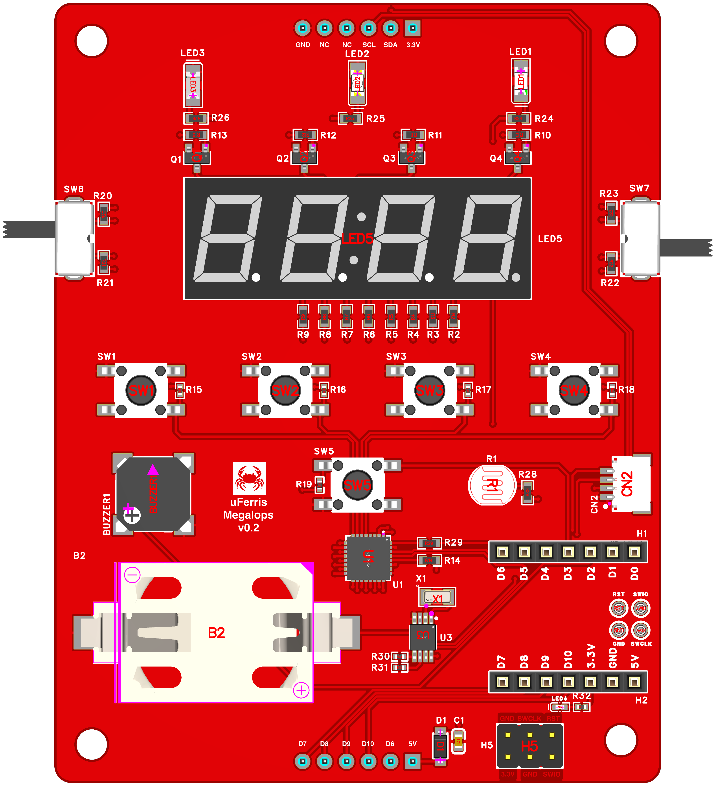
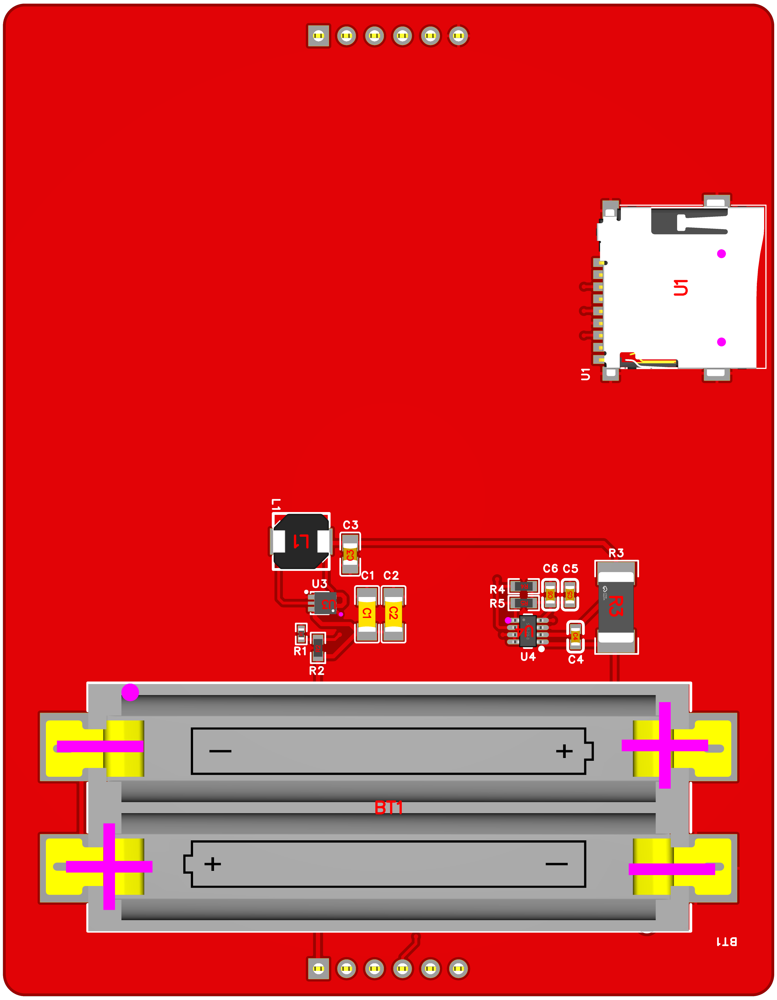
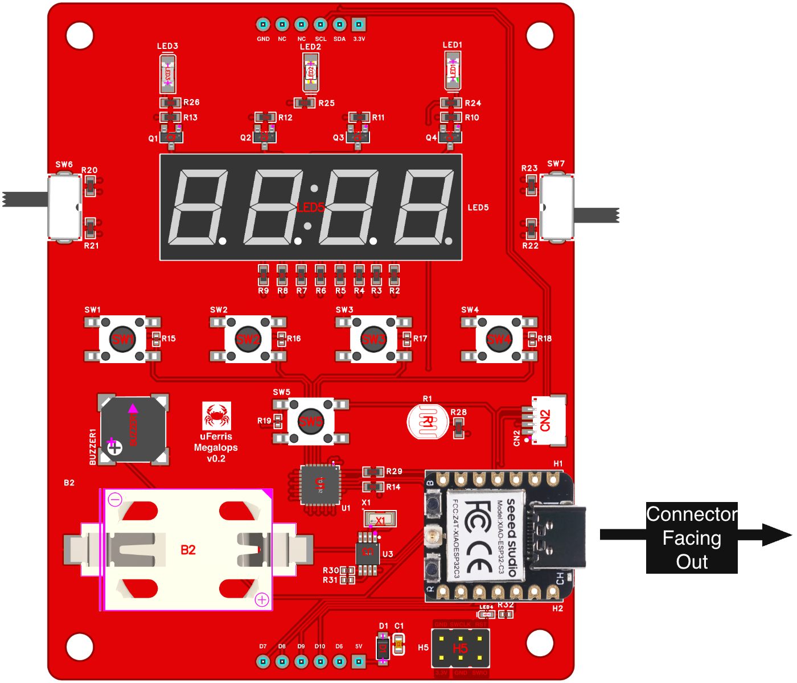
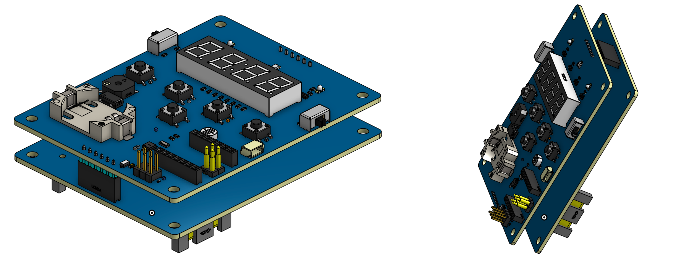
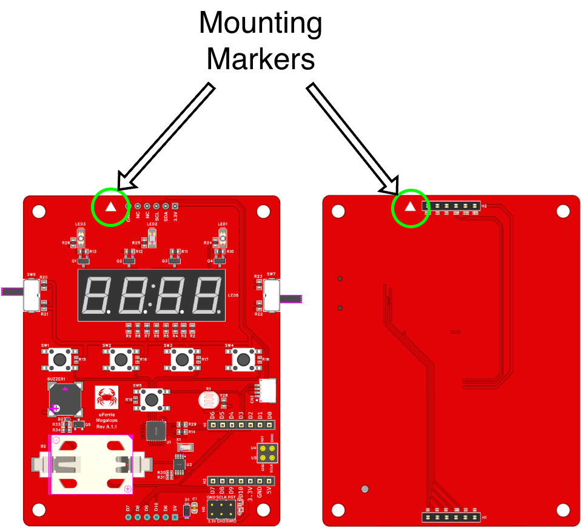

# 🦀 Getting Started with uFerris

## 📦 Platform Components

The uFerris platform consists of three components:

- **Megalops Baseboard** — The main uFerris board.
- **Megalops Power Extension Board** *(optional)* — Powerboard for the baseboard.
- **Seeed Studio XIAO Module** — Controller board for the uFerris baseboard.

To get started with uFerris you would need at minimum the baseboard and a XIAO board of your choice. For the purposes of this guide, the XIAO ESP32-C3 will be used.

## 🔍 Board Overview

### Megalops Baseboard

<p align="center">
  
</p>

The Megalops baseboard is designed around the Seeed Studio XIAO platform. It supports multiple XIAO controllers, letting you swap MCUs while keeping the same board and peripherals. The board enables you to exercise every standard peripheral: GPIO, timers/counters, ADC, PWM, UART, and I²C.

Key components on the baseboard:

- 3 LEDs (1 direct GPIO, 2 via I/O expander)
- Buzzer (direct GPIO/PWM)
- 5 push buttons (1 direct GPIO, 4 via I/O expander)
- 2 toggle switches (via I/O expander)
- Light sensor (analog, direct GPIO)
- 4-digit 7-segment display (via I/O expander)
- TCA6424A I/O expander (I2C)

#### 🔋 Board Power

The uFerris is powered and controlled by the XIAO module. The XIAO module, in turn, can receive power from three different sources:

1. Via the USB-C connection on the XIAO.
2. Via the powerboard 2xAAA batteries.
3. Via the SWD debug connection.

> 📝 **NOTE:** The uFerris can still be powered by the USB-C connection while the powerboard is attached. However, flashing and serial communication might fail if the batteries are inserted.

### Megalops Power Extension Board (Optional)

<p align="center">
  
</p>

The power extension board is an optional add-on that enables standalone operation (Ex. running a program to collect data without a power cable).

Key components on the power board:

- 2×AAA battery holder.
- Current measurement circuit for power profiling.
- SD card slot for data logging (SPI).

## 🔧 Mounting Instructions

### XIAO Module Mounting
The XIAO module is mounted on the baseboard XIAO header. The figure below shows the mounting orientation for the XIAO module. Note how the USB connector of the module needs to always face outward.

<p align="center">
  
</p>

### Power Extension Board Mounting
To mount the powerboard, align both top and bottom headers of the baseboard and the power extension board, then press down until the baseboard is firmly seated. The XIAO header on the baseboard and the battery holder on the powerboard should face **downward** as shown in the figure below.

More recent editions of the boards also have mounting markers as shown in the figure below. These markers indicated the mounting direction and need to align with each other.

> ⚠️ **WARNING:** Incorrect orientation of the power extension board will damage the baseboard and/or the XIAO. Always verify the orientation before powering the board.

<p align="center">
  
</p>

<p align="center">
  
</p>

## 📌 Baseboard Pinout Reference
Each component on the board has a unique reference ID and is wired either to the XIAO module or the I/O expander. The figure below labels the reference IDs for the different baseboard components. Additionally, the table below shows wiring mapping of the components to either of the device pins. 

> 📝 **NOTE:** The RTC, I/O Expander, and QWIIC connector are all wired to the SDA/SCL lines since they are I2C operated.

<p align="center">
  
</p>

The table below provides a comprehensive mapping of the various components and their connections to the Xiao, I/O Expander, Bottom Header (H3), Top Header (H4), and ESP32-C3 pins. 

> **NOTE:** For up to data mappings for other XIAO devices, refer to the [uferris-hw repo](https://github.com/uFerris-rs/uferris-hw/tree/main/docs).

| Component Label   | Component Connection   | Xiao Pin  | I/O Expander Pin   | Bottom Header Pin   | Top Header Pin   | Direction   | ESP32-C3 Pin   |
|:------------------|:-------------|:-------|:---------------|:---------------|:---------------|:------------|:---------------|
| Alarm             | LED 1        | D1/A1  | -              | -              | -              | Output      | GPIO3          |
| LED               | LED 2        | -      | P14            | -              | -              | Output      | -              | 
| PM                | LED 3        | -      | P15            | -              | -              | Output      | -              | 
| -                 | Buzzer       | D2/A2  | -              | -              | -              | Output      | GPIO4          | 
| Hour              | SW1          | -      | P07            | -              | -              | Input       | -              |
| Minute            | SW2          | -      | P06            | -              | -              | Input       | -              | 
| Time              | SW3          | -      | P05            | -              | -              | Input       | -              |
| Alarm             | SW4          | -      | P04            | -              | -              | Input       | -              | 
| Snooze            | SW5          | D3     | -              | -              | -              | Input       | GPIO5          | 
| 12                | SW6 Pos 1    | -      | P16            | -              | -              | Input       | -              | 
| 24                | SW6 Pos 2    | -      | P17            | -              | -              | Input       | -              | 
| On                | SW7 Pos 1    | -      | P00            | -              | -              | Input       | -              | 
| Off               | SW7 Pos 2    | -      | P01            | -              | -              | Input       | -              | 
| -                 | SDA          | D4     | -              | -              | P2             | Comms       | GPIO6          | 
| -                 | SCL          | D5     | -              | -              | P3             | Comms       | GPIO7          | 
| -                 | LDR          | D0/A0  | -              | -              | -              | Analog      | GPIO2          | 
| -                 | Digit 1      | -      | P10            | -              | -              | Output      | -              | 
| -                 | Digit 2      | -      | P11            | -              | -              | Output      | -              | 
| -                 | Digit 3      | -      | P12            | -              | -              | Output      | -              | 
| -                 | Digit 4      | -      | P13            | -              | -              | Output      | -              | 
| -                 | Seg A        | -      | P20            | -              | -              | Output      | -              | 
| -                 | Seg B        | -      | P21            | -              | -              | Output      | -              | 
| -                 | Seg C        | -      | P22            | -              | -              | Output      | -              | 
| -                 | Seg D        | -      | P23            | -              | -              | Output      | -              | 
| -                 | Seg E        | -      | P24            | -              | -              | Output      | -              | 
| -                 | Seg F        | -      | P25            | -              | -              | Output      | -              | 
| -                 | Seg G        | -      | P27            | -              | -              | Output      | -              | 
| -                 | DP           | -      | P26            | -              | -              | Output      | -              | 
| -                 | XiaoTx       | D6     | nINT           | P2             | -              | -           | GPIO21         | 
| -                 | XiaoMosi     | D10    | -              | P3             | -              | -           | GPIO10         | 
| -                 | XiaoMiso     | D9     | -              | P4             | -              | -           | GPIO9          | 
| -                 | XiaoScl      | D8     | -              | P5             | -              | -           | GPIO8          | 
| -                 | XiaoRx       | D7     | -              | P6             | -              | -           | GPIO20         | 

## 🛠️ Toolchain Setup

1. **Install Rust**

```bash
curl --proto '=https' --tlsv1.2 -sSf https://sh.rustup.rs | sh
```

2. **Add the RISC-V Target** (for ESP32-C3)

```bash
rustup target add riscv32imc-unknown-none-elf
```

> 📝 **NOTE:** The target refers to the architecture being targeted by the cross-compiler for the device you want to generate code for. Each XIAO device would probably have a different one.

3. **Install espflash**

```bash
cargo install espflash --locked
```

4. **Install esp-generate**

```bash
cargo install esp-generate --locked
```

## 🚀 Your First Project

1. **Generate a New Project**

```bash
esp-generate --chip esp32c3 -o unstable-hal -o vscode -o esp-backtrace -o log --headless blinky
cd blinky
```

> 📝 **NOTE:** While Espressif offers `esp-generate` to generate projects, this step might be different for non-ESP XIAO devices.

2. **Write the Blink Code**

Replace the contents of `src/main.rs` with:

```rust
#![no_std]
#![no_main]

use esp_backtrace as _;
use esp_hal::delay::Delay;
use esp_hal::gpio::{Level, Output};
use log::info;

#[esp_hal::main]
fn main() -> ! {
    let config = esp_hal::Config::default();
    let peripherals = esp_hal::init(config);

    let mut led = Output::new(peripherals.GPIO3, Level::Low);
    let delay = Delay::new();

    info!("Blinking LED 1!");

    loop {
        led.toggle();
        delay.delay_millis(500);
    }
}
```

3. **Connect and Flash**

Connect the XIAO to your laptop via USB-C, then build and flash:

```bash
cargo run --release
```

You should see LED 1 on the uFerris board blinking. 🎉

## 📚 Running the BSP Demo

The uFerris BSP provides a hardware-agnostic API that works across all supported XIAO controllers.

**BSP Repository:** [https://github.com/uFerris-rs/uferris-bsp](https://github.com/uFerris-rs/uferris-bsp)

1. **Clone the BSP Repository**

```bash
git clone https://github.com/uFerris-rs/uferris-bsp.git
cd uferris-bsp
```

2. **Run an Example**

```bash
cd examples/xiao-esp32c3
cargo run --bin blinky
```

> ❗️ **IMPORTANT:** The BSP uses Cargo feature flags to select your XIAO controller and optional extensions. It assumes the power board extension board is attached and enables the `power-board` feature flag. As such, if the powerboard is not attached, the run might fail. As such, in your project's `Cargo.toml`, enable or disable the features to match your setup. For the latest feature list, always refer to the [uferris-bsp crate documentation](https://crates.io/crates/uferris-bsp). 

## 🔗 Useful Links

- **uFerris BSP:** [https://github.com/uFerris-rs/uferris-bsp](https://github.com/uFerris-rs/uferris-bsp)
- **uFerris Hardware:** [https://github.com/uFerris-rs/uferris-hw](https://github.com/uFerris-rs/uferris-hw)
- **ESP Rust Documentation:** [https://docs.espressif.com/projects/rust/](https://docs.espressif.com/projects/rust/)
- **Simplified Embedded Rust (Book):** [https://www.theembeddedrustacean.com/](https://www.theembeddedrustacean.com/)
